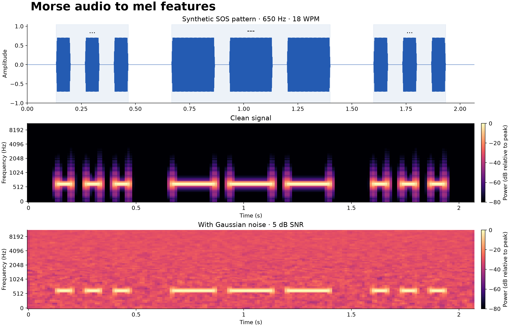
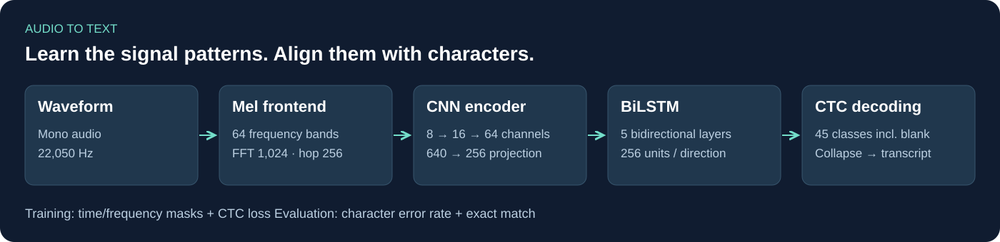
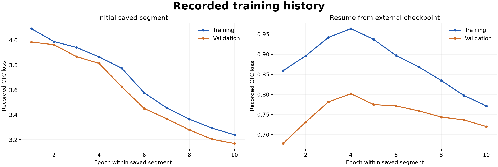

# Morse Code Recognition

**Audio-to-text sequence modeling with mel spectrograms, a CNN–BiLSTM encoder, and CTC.**

[](https://github.com/IvanTriandofilidi/Morse-code-recognition.-ASR/actions/workflows/ci.yml)


I built this project to transcribe Morse-code recordings without manually segmenting dots, dashes, or characters. It applies an ASR-style pipeline to keyed audio: a CNN extracts local patterns, a bidirectional LSTM models temporal context, and CTC learns the alignment between frames and text.

The target alphabet contains **32 Cyrillic letters, 10 digits, `#`, and a space**, plus the CTC blank. Documentation and tooling are in English; the target alphabet remains faithful to the original task.



*Synthetic SOS illustration: 650 Hz, 18 WPM, clean and 5 dB SNR. These are signal-processing examples, not model predictions. Both spectrograms use 64 mel bands and a −80 to 0 dB color scale relative to each recording's peak.*

## Architecture



| Stage | Implementation |
|---|---|
| Audio frontend | Mono, 22,050 Hz; FFT 1,024; hop 256; 64 mel bands |
| Training augmentation | Frequency and time masking, up to 10% of each axis |
| CNN | Three Conv2D → BatchNorm → ReLU blocks, channels 8 → 16 → 64; average pooling |
| Projection | 640 features per output frame → 256 |
| Temporal encoder | Five bidirectional LSTM layers; 256 hidden units per direction; dropout 0.5 |
| Output head | 512 → 512 → 45 frame-level logits |
| Objective / decoding | CTC loss; greedy collapse of adjacent repeats, then blank removal |
| Evaluation | Corpus CER, mean utterance CER, exact-match rate |

The default model contains **7,821,053 trainable parameters**. Each recording is convolved at its native length, then packed for the recurrent encoder. This prioritizes correct variable-length boundaries over maximum CNN throughput.

## Quick start

```bash
git clone https://github.com/IvanTriandofilidi/Morse-code-recognition.-ASR.git
cd Morse-code-recognition.-ASR
python -m venv .venv
# macOS / Linux: source .venv/bin/activate
# Windows PowerShell: .venv\Scripts\Activate.ps1
python -m pip install -e ".[dev]"
python -m morse_asr.demo --output runs/demo
```

The demo needs no credentials or trained weights. It generates the mel figure, clean/noisy WAV files, and eight synthetic recordings with a manifest. Start with the [English walkthrough](notebooks/01_audio_to_text.ipynb) for audio features, tensor shapes, and CTC decoding.

To run the notebook in a Jupyter-compatible editor, install `python -m pip install -e ".[notebooks]"` and select that environment's Python kernel. Rebuild the historical loss figure with `python scripts/plot_history.py`.

## Train and transcribe

Supply a UTF-8 CSV with `id,audio_path,message`. Paths resolve relative to the manifest; IDs remain strings. For prediction, `message` is optional. See [the data contract](docs/data.md).

```bash
# CPU integration run; checks execution, not recognition quality.
morse-asr train --manifest runs/demo/manifest.csv --output runs/smoke --epochs 1 --batch-size 3 --hidden-size 8 --layers 1

# Full architecture on your labeled dataset.
morse-asr train --manifest data/train.csv --output runs/full --epochs 10 --device cuda

# Independently prepared labeled holdout.
morse-asr evaluate --manifest data/holdout.csv --checkpoint runs/full/best.pt --output runs/holdout-predictions.csv --device cuda

# All input IDs are retained, including the final partial batch.
morse-asr predict --manifest data/test.csv --checkpoint runs/full/best.pt --output runs/submission.csv --device cuda
```

Training saves split IDs, audio hashes, per-epoch metrics, and the checkpoint with the lowest validation corpus CER. Checkpoints carry the alphabet, frontend settings, and model configuration. Evaluation reports recording overlap with training and checkpoint selection.

## Engineering decisions

- **Explicit manifests:** reject duplicate IDs, paths, and byte-identical training recordings; validate target characters.
- **Exact CTC lengths:** derive lengths from layer geometry and reject impossible alignments, including repeated target symbols.
- **Deterministic evaluation:** augmentation is training-only; greedy decoding respects valid lengths and blank-separated repeats.
- **Reproducible execution:** seeded splits, saved settings, portable CLI, and automated tests.
- **Shared frontend:** training and inference use the same configuration; examples and plots regenerate from code.

## Experiments and status

The original notebook contains two saved ten-epoch training logs. The second starts from an external `epoch60.pt` checkpoint. These are separate recorded segments, not a continuous reproduced run.



The full dataset and trained checkpoint are not distributed here. The package is verified with tests and a synthetic training/evaluation run; full-data recognition accuracy has not yet been re-measured. [Evaluation notes](docs/evaluation.md) explain the historical results and changes affecting comparability.

## Project layout

```text
src/morse_asr/       Frontend, model, CTC, metrics, manifests, CLI
tests/              Decoding, lengths, padding, loss, and data contracts
notebooks/          English walkthrough
docs/assets/        Mel spectrograms, architecture, and training curves
reports/            Source-derived logs and local verification
.github/workflows/  Automated tests and CPU integration run
```

```bash
ruff check src tests
pytest -q
```

## Sources

- [Research notebook](https://colab.research.google.com/drive/1No2sGkfO9HtZb6SGwFen3HsfVQ_IXsYz)
- [Original repository snapshot](https://github.com/IvanTriandofilidi/Morse-code-recognition.-ASR/tree/fd58dbbd1dac0c57ab422a7b092d00ac2ca9b898)
- [Dataset competition](https://www.kaggle.com/competitions/morse-decoder)

Dataset access and reuse follow the provider's terms. Synthetic examples contain no competition recordings. No separate open-source license has been granted for this repository.
